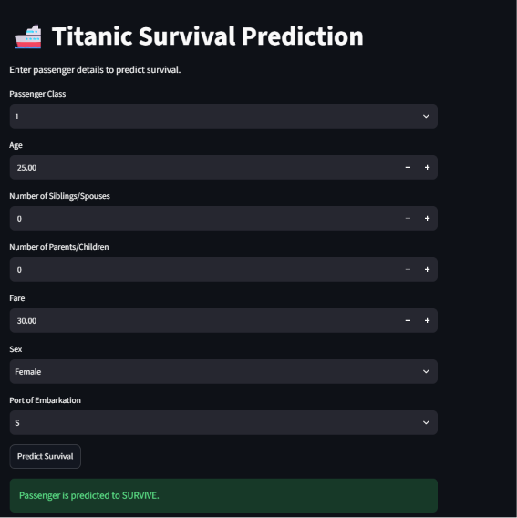
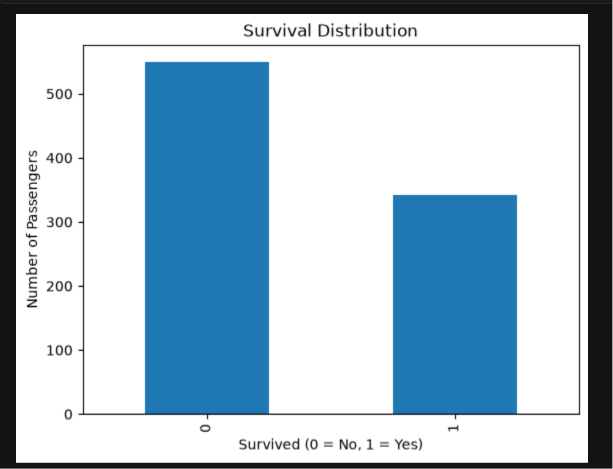
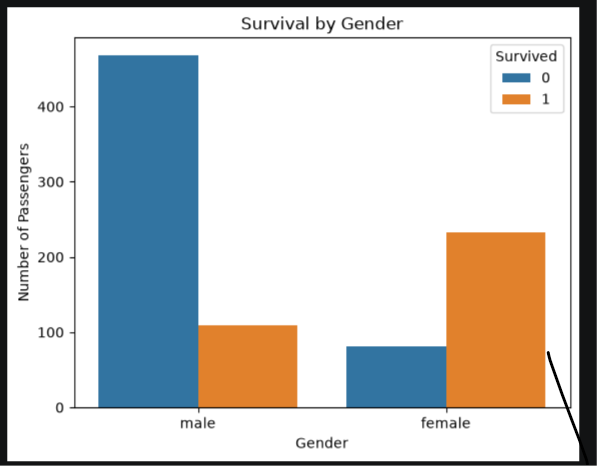
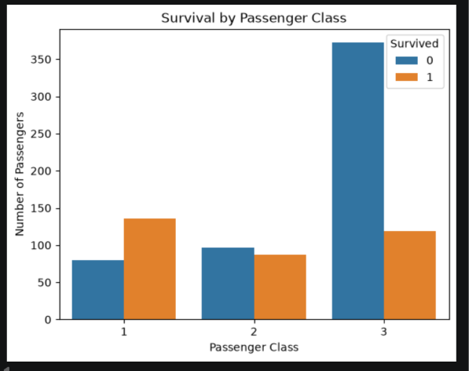
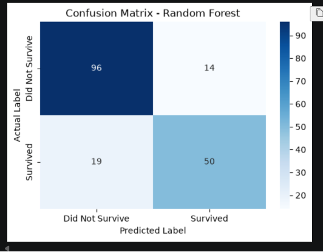
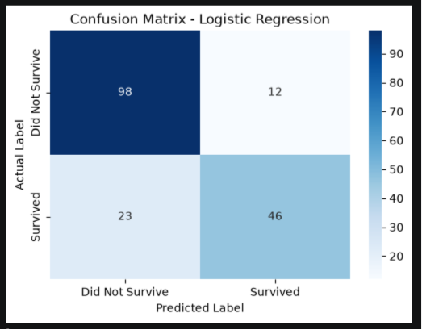

# Titanic Survival Prediction

> An end-to-end Machine Learning project that predicts whether a Titanic passenger is likely to survive based on passenger characteristics.

## Live Demo

**Streamlit Application:**  
https://titanicsurvivalprediction-ioudftgjjda28fku2kcgu8.streamlit.app

**GitHub Repository:**  
https://github.com/Naina137/Titanic_Survival_Prediction

### Application Preview



---

## Project Overview

Titanic Survival Prediction is an end-to-end Machine Learning project developed using Python and Scikit-learn.

The project covers the complete Machine Learning workflow, including data preprocessing, exploratory data analysis, feature engineering, model development, evaluation, model serialization, and deployment.

The trained model is integrated into an interactive Streamlit web application that allows users to enter passenger details and obtain a survival prediction.

---

## Objectives

- Analyze and preprocess the Titanic passenger dataset
- Perform exploratory data analysis and visualization
- Identify important factors associated with passenger survival
- Develop classification models for survival prediction
- Evaluate and compare model performance
- Save the trained model using Joblib
- Develop an interactive Streamlit application
- Deploy the Machine Learning model as a web application

---

## Technologies Used

| Category | Technologies |
|---|---|
| Programming Language | Python |
| Data Analysis | Pandas, NumPy |
| Data Visualization | Matplotlib, Seaborn |
| Machine Learning | Scikit-learn |
| Model Serialization | Joblib |
| Web Application | Streamlit |
| Development Environment | Jupyter Notebook, VS Code |
| Version Control | Git, GitHub |

---

## Dataset

The project uses the Titanic passenger dataset.

### Features

| Feature | Description |
|---|---|
| Pclass | Passenger class |
| Age | Passenger age |
| SibSp | Number of siblings or spouses aboard |
| Parch | Number of parents or children aboard |
| Fare | Passenger fare |
| Sex | Passenger gender |
| Embarked | Port of embarkation |
| Survived | Target variable |

### Target Variable

- `0` — Did not survive
- `1` — Survived

---

## Exploratory Data Analysis

Exploratory Data Analysis was performed to understand passenger characteristics and identify patterns associated with survival.

### Survival Distribution



### Survival by Gender



### Survival by Passenger Class



### Key Findings

- Survival rates differed significantly between male and female passengers.
- Passenger class showed a strong relationship with survival outcomes.
- The dataset contained more passengers who did not survive than passengers who survived.

---

## Machine Learning Models

Two classification algorithms were implemented and evaluated.

### Logistic Regression

Logistic Regression was used as a baseline classification model because of its simplicity and interpretability.

### Random Forest Classifier

Random Forest was implemented as an ensemble learning approach capable of capturing nonlinear relationships between passenger characteristics and survival.

---

## Model Evaluation

The models were evaluated using the following metrics:

- Accuracy
- Precision
- Recall
- F1-Score
- Confusion Matrix

### Random Forest Confusion Matrix



### Logistic Regression Confusion Matrix



---

## Streamlit Web Application

The trained Machine Learning model has been integrated into an interactive Streamlit application.

Users can provide the following passenger information:

- Passenger Class
- Age
- Number of Siblings/Spouses
- Number of Parents/Children
- Fare
- Sex
- Port of Embarkation

The application processes the input and returns the predicted survival outcome.

### Live Application

https://titanicsurvivalprediction-ioudftgjjda28fku2kcgu8.streamlit.app

---

## Project Structure

```text
Titanic_Survival_Prediction/
│
├── Titanic_Survival_Prediction.ipynb
├── app.py
├── model.pkl
├── requirements.txt
├── README.md
│
├── data/
│   └── data/
│       └── train.csv
│
├── notebook/
│
└── images/
    ├── streamlit_app.png
    ├── survival_distribution.png
    ├── survival_gender.png
    ├── survival_class.png
    ├── random_forest_cm.png
    └── logistic_regression_cm.png


Dataset
   |
   v
Data Cleaning and Preprocessing
   |
   v
Exploratory Data Analysis
   |
   v
Feature Engineering
   |
   v
Train-Test Split
   |
   v
Model Training
   |
   +-----------------------+
   |                       |
   v                       v
Logistic Regression    Random Forest
   |                       |
   +-----------+-----------+
               |
               v
        Model Evaluation
               |
               v
          Model Saving
               |
               v
      Streamlit Application
               |
               v
           Deployment

## Author

**Naina Kumari**

Data Science Undergraduate | Machine Learning Enthusiast | Data Analyst

This project was developed as part of my hands-on learning journey in
Data Science and Machine Learning, with the goal of understanding the
complete process of developing, evaluating, and deploying a Machine
Learning application.

### Connect with Me

- GitHub: https://github.com/Naina137
- LinkedIn: https://www.linkedin.com/in/naina-kumari-06373132b

This project reflects my interest in applying Data Science and Machine Learning to real-world problems.

 Through this project, I explored the complete ML lifecycle, from data preprocessing and analysis to model development, evaluation, and deployment.
